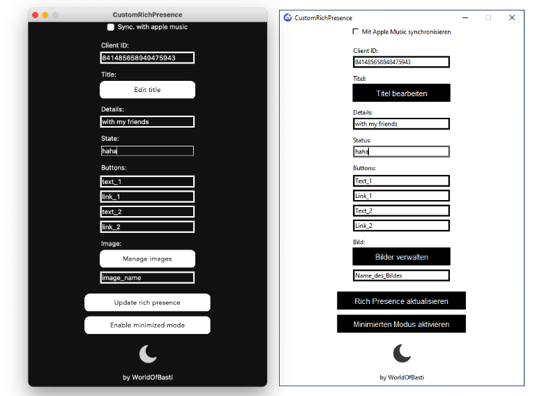
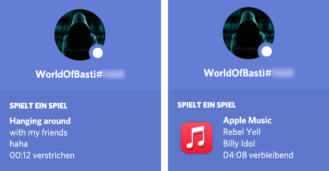

# CustomRichPresence

CustomRichPresence is a tool which helps you to customize your Rich Presence on Discord. It is built with Python and is available for Windows, macOS and Linux.  
If you are on macOS, you can also sync your Rich Presence with Apple Music. 
 

 

 
Two languages are currently supported:
- English
- German

## Usage

### Installation
You can watch [this Tutorial](https://youtu.be/BJbhq8fH0rc) or follow these steps:
- Download the program [of the release page](https://github.com/WorldOfBasti/CustomRichPresence/releases) and run it:
	- **Windows**: Download the *.exe*. You should be able to start it.
	- **macOS**: Download the *.app*. You should be able to start it.
	- **Linux**: Download the *linux-install folder*. Open your terminal and navigate to that folder. Type:  
	`sudo chmod +x install.sh`  
	`sudo ./install.sh`  
	You should be able to start the application via the Applications Menu
- Create a new application on the [discord developer page](https://discord.com/developers/applications). (The name is also the name of your Rich Presence. You can change it at any time.)
- Copy your Application ID from the developer page and paste it in the Client ID entry.
- Now you can customize your Rich Presence as you wish.

Don't forget to click the "Update rich presence" button or press enter!

### Edit Rich Presence Title
If you want to change your Rich Presence Title, click the "Edit title" Button and change the name of the Application.  
Currently, you need to restart CustomRichPresence after that.

### Adding Buttons
You can add two buttons to your Rich Presence. To do that, you need to write the text of a button in one of the text entries, then you need to add a link to the link entry. (You can't click your own buttons, they will only work for other users.)

### Adding Images
If you want to add an image to your Rich Presence, you can click the "Manage images" Button and add them. It may take a while until Discord processed the images to their servers.  
After that you need to write the name of the image to the "image_name" entry.

### Sync with Apple Music
If you are on macOS you can sync your Rich Presence with Apple Music. You only have to check the checkbox on top of the program. If you start playing a song, it will sync with your Discord Rich Presence. (The timer of your music won't be up to date because the apple script doesn't work. We need to wait for a fix from Apple..)

## Building
If you want to build CustomRichPresence from source, you need to do a couple of things:
- Make sure you have [Python](https://www.python.org/downloads/) at least version 3.8 installed
- Download the source
- Install all [required modules](requirements.txt)
- Build the program:
	- **Windows**: You can use [auto-py-to-exe](https://github.com/brentvollebregt/auto-py-to-exe) or compile it manually with [Pyinstaller](http://www.pyinstaller.org) (Please adjust the paths):  
`pyinstaller --noconfirm --onefile --windowed --icon "C:/path/to/CustomRichPresence/files/icon_windows.ico" --add-data "C:/path/to/CustomRichPresence/files;files/"  "C:/path/to/CustomRichPresence/CustomRichPresence.py"`
	- **macOS**: Open your Terminal, navigate to the source directory and type:  
`python3 setup_mac.py py2app`
	- **Linux**: You can compile it using [Pyinstaller](http://www.pyinstaller.org). In your terminal, go to the source directory and type (Please adjust the paths):  
`pyinstaller CustomRichPresence.py --onefile --windowed --hidden-import="PIL._tkinter_finder" --add-data "/path/to/CustomRichPresence/files/:files"`

## Acknowledgements
Without these modules/etc. it wouldn't have been possible to create this project. So thank you all very much:
- [pypresence](https://github.com/qwertyquerty/pypresence) for the Discord Rich Presence interface
- [TkinterCustomButton](https://github.com/TomSchimansky/GuitarTuner/blob/master/documentation/tkinter_custom_button.py) for the custom buttons
- [this post](https://gist.github.com/codiez/260617/b0022ce6413fe016f146beb515ae90d49fbfcd21) for the Apple Music implementation
- And all other modules I have used

## Want to support this project?
The best way to support this project is to create issues and sending pull requests. Alternatively, you can translate the program to [other languages](src/Resources). 